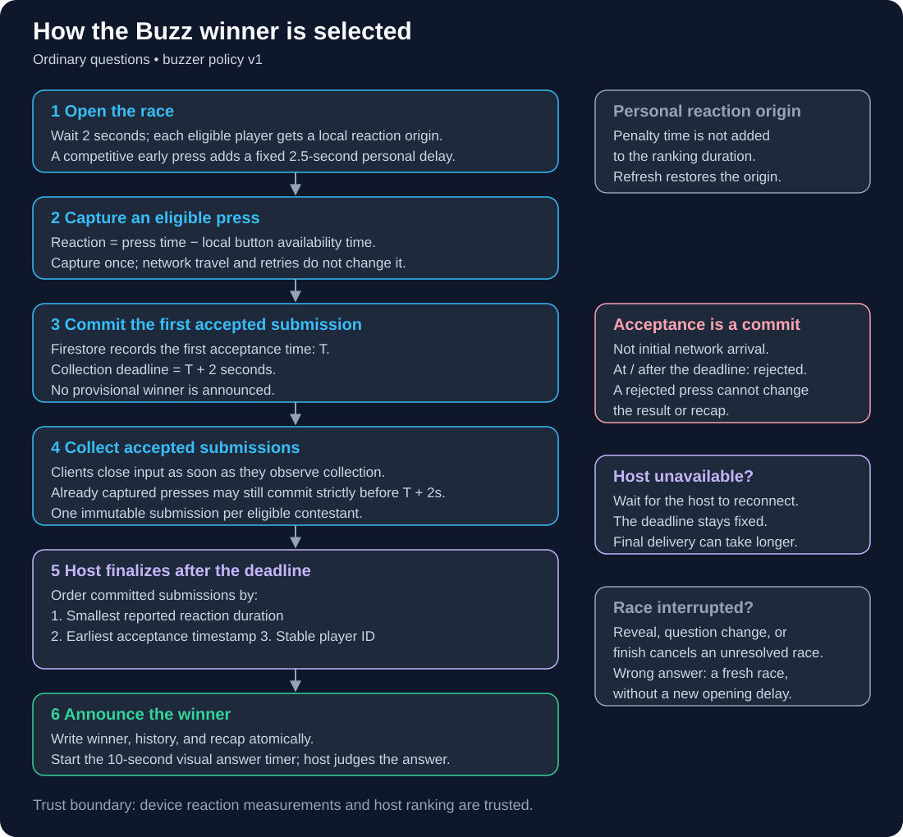
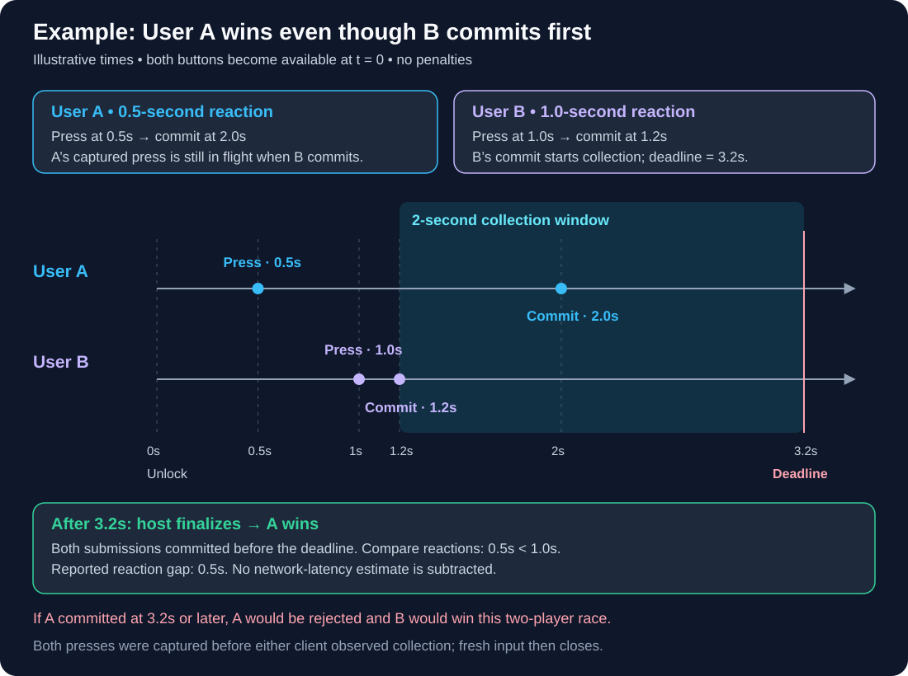

# How the Buzz winner is determined

The winner is the eligible contestant with the **smallest reported local reaction duration among accepted submissions**. The first Firestore commit starts a two-second collection window. The host finalizes the result after that window closes.

These diagrams describe ordinary questions in rooms with `buzzerPolicyVersion: 1`. Existing rooms without that policy keep their previous behavior. Surprise questions use their separate contestant-selection flow.

## Selection flow

The initial opening delay is **2 seconds**. A reaction starts when the local client renders the button as available. Button and Space presses use the same handler. The client captures the reaction duration once using a monotonic clock; transaction retries preserve that value.

In competitive mode, the first early press adds a fixed **2.5-second personal delay**. Repeated presses during that penalty do not extend it. The penalized contestant's reaction starts at their personal availability; the penalty itself is not added to their ranking duration. Refresh restores the saved reaction origin, using the shared personal unlock timestamp as a fallback.

The first accepted submission commits at time **T**. Other submissions must commit **strictly before T + 2 seconds**. Acceptance means a Firestore commit, not the time a network request first arrives. The normal client stops accepting new input when it observes collection starting, while previously captured, in-flight presses may still commit before the deadline.

The host sorts accepted submissions in this order:

1. Lowest reported reaction duration.
2. Earliest server acceptance timestamp, if reaction durations tie.
3. Stable player ID in ascending order, if both values tie.

Finalization writes the winner, history, and recap atomically. The **10-second visual answer timer** starts at finalization and never judges answers or changes scores automatically. If the host is unavailable, resolution waits for the host to return; the collection deadline does not reopen. Result delivery can therefore take longer than two seconds.

Reveal, question change, or game finish cancels an unresolved race. A wrong answer opens a fresh race for remaining eligible contestants without another opening delay; any unexpired personal penalty still applies.

## Example: User A and User B

Assume both contestants' buttons become available at the same time, **t = 0**, after the opening delay. Neither contestant has a penalty. The times below are illustrative, not measurements from a test run.

| Event | User A | User B |
| --- | --- | --- |
| Local press / captured reaction | 0.5s | 1.0s |
| Firestore commit | 2.0s | 1.2s |
| Before the 3.2s deadline? | Yes | Yes |
| Final result | **Winner** | Reported reaction gap: 0.5s |

B's commit at **1.2s** starts collection, so the deadline is **3.2s**. A's press was already captured and commits at **2.0s**, inside that window. A wins because **0.5s is less than 1.0s**. No estimated network latency is subtracted from either duration.

Both presses in this example happen before either client observes collection. If A instead committed at **3.2s or later**, that submission would be rejected, and B would win this two-contestant race. If their reactions tied, acceptance time would decide; a zero-gap tie does not qualify for the positive-gap “closest late” achievement.

## Trust and implementation references

Browser reaction measurements and host ranking are trusted. Firestore rules enforce submission ownership, eligibility, recorded penalties, immutable submissions, and server commit deadlines. The rule that a press must already be in flight when the client observes collection is enforced by the normal client, not independently proven by Firestore.

- [Timing constants and ranking](../src/utils/buzzerPolicy.js)
- [Local reaction capture and host scheduling](../src/hooks/useBuzzer.js)
- [Submission and finalization actions](../src/actions/buzzerActions.js)
- [Race lifecycle](../src/actions/buzzerState.js)
- [Firestore rules](../firestore.rules)
- [Full gameplay reference](gameplay-reference.md)
- [Manual validation commands and coverage](game-storage-validation.md)

Both diagrams are standalone SVG files with explicit dark backgrounds, editable text, and accessible descriptions. This document was prepared from the implementation; no verification scripts or browser checks were launched. Follow the user-run verification policy in [AGENTS.md](../AGENTS.md).
